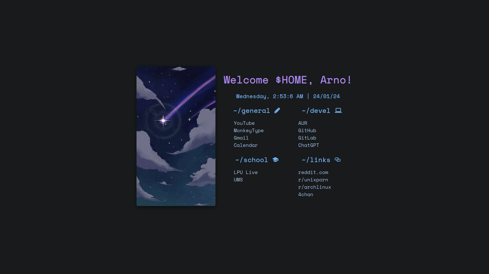

# ✨ My Awesome Startpage

Welcome to my custom startpage inspired by [Fazzi's repository](https://gitlab.com/fazzi/startpage). This startpage provides a clean and minimalist interface for your browser's new tab page.

## Screenshots 🖼️




## Build Process 🛠️

To deploy this startpage, follow these steps:

### Using Docker 🐋

1. Make sure you have Docker installed on your system.

2. Build the Docker image using the provided Dockerfile:

   ```bash
   git clone https://github.com/smazmi/startpage
   cd startpage/
   docker build -t startpage .
   ```

## Run the Docker Container 📦

```bash
docker run -d -p 8080:80 --name startpage --restart unless-stopped startpage
```

- Replace **8080** with the desired port number.
- Open your browser and navigate to http://localhost:8080 (or the chosen port).

## Manual Deployment 🔧

1. Copy the contents of the **frontpage** folder to your web server or hosting provider.
2. If using Nginx, copy the contents of the **usr** folder to **/usr/share/nginx/html/src**.
3. Access the startpage by navigating to the appropriate URL on your server.

## Folder Structure 📁

```
 .
├──  arno
│  └──  index.html
├──  Dockerfile
├──  README.md
├──  src
│  ├──  css
│  │  └──  style.css
│  ├──  fonts
│  │  ├──  SpaceMonoNF.woff
│  │  └──  SpaceMonoNF.woff2
│  ├──  images
│  │  ├──  cover1.webp
│  │  ├──  cover2.webp
│  │  └──  cover3.webp
│  └──  js
│     ├──  date.js
│     └──  theme.js
└──  ss.png
```

## Customize ⚙️

Feel free to customize the startpage by modifying the HTML, CSS, and JavaScript files in the **frontpage** and **src** folders.
